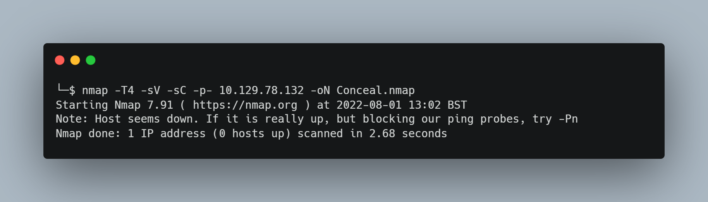
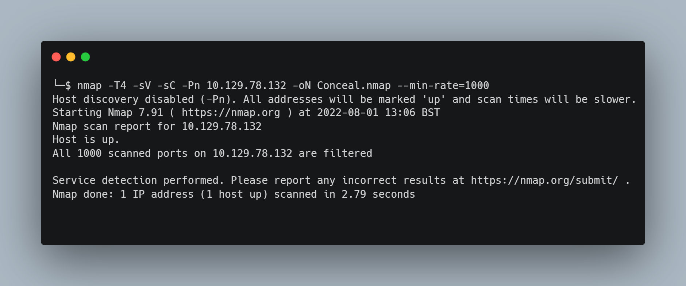
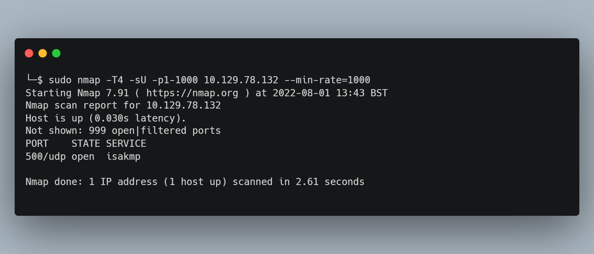
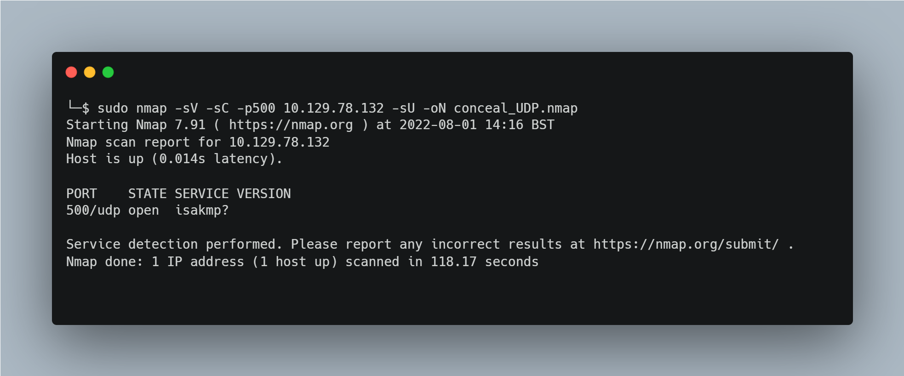
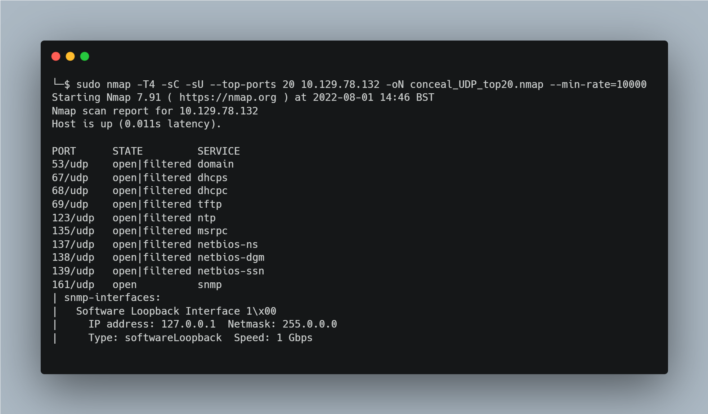
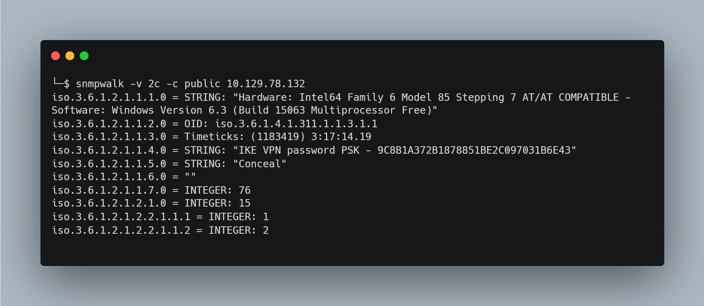
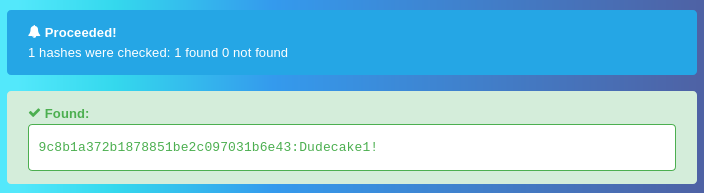
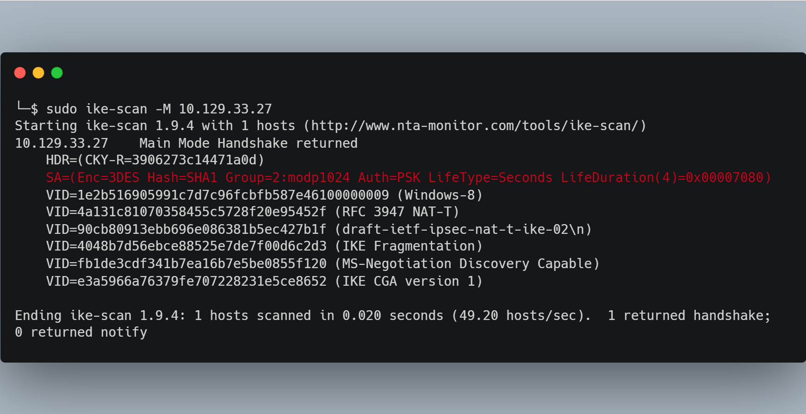
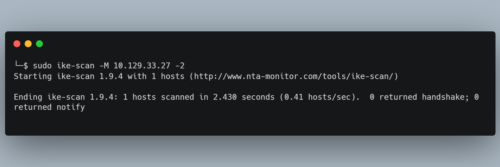

# Conceal

## Introduction
COMING SOON!

## Phase 1 - Reconnaissance
The initial enumeration stage of this machine isn’t as straightforward as previous machines which is one of the many reasons this machine earned it’s hard difficulty rating. As usual we will start with nmap, however there are some initial set-ups that are required before we can enumerate all of the TCP ports on this machine. The enumeration phase for this machine will take us through some IPSEC via UDP port scanning, key exchange protocols and Simple Network Management Protocol (SNMP).

### Initial Port Scan
We can start by using our usual nmap command,  my go to usage of nmap is ''nmap -T4 -sC -sV [target-IP] -oN Conceal.nmap'' with the IP of our target. However the initial scan is being blocked, although we will be able to ping the target, using nmap currently yields the following result:

When this happens, it can sometimes be because the host is blocking the probes, nmap suggests using ''-Pn'' instead of ''-p-'' in order to skip host discovery and instead scan only the ports. This can take a while so I recommend also adding ''--min-rate=1000'' to our command to ensure at least 1000 packets are sent per second.

Now the scan can see that the host is up but all of the ports are filtered. There is some kind of network security protocol at play that is preventing us from being able to scan the TCP ports for this machine. This can be enough to stop some users in their tracks but as the saying goes, we’re going to need to try harder.

### UDP Port Scan
For the next scan we are going to see if there are any UDP ports open on the target host, often the security protocols that prevent us from scanning for TCP ports are running on a UDP port so it’s worth investigation when in this situation, to do this we use ''-sU'' in the nmap command. You may need to run the command with ''sudo'' as it requires root privilages. This scan will take an extremely long time to go through all 1000 ports and run the scripts against them so to avoid this we’ll not run any scripts or service scans, retain our minimum rate and scan only ports between 1 and 1000.

The scan revealed UDP port 500 running a ISAKMP service. ISAKMP stands for Internet Security Association and Key Management Protocol, it serves as a common framework for defining the agreed formats and procedures for authenticating a communication peer and for the creation and management for security associations, key generation techniques, and to mitigate threats such as DoS and replay attacks. ISAKMP is used to implement the Microsoft Windows IPSEC service. More information can be found at https://en.wikipedia.org/wiki/Internet_Security_Association_and_Key_Management_Protocol.

It appears from this information and our scan that UDP 500 is being used to run an IPSEC VPN service on this machine which is likely the reason we cannot conduct a TCP port scan with NMAP, since TCP connections are probably restricted to this IPSEC VPN. ISAKMP needs to be implemented alongside protocols that provide the authenticated keying material such as Internet Key Exchange (IKE) or Kerberized Internet Negotiation of Keys (KINK).  We can attempt to find the Key Exchange protocol being used with nmap again but this time we will run script and service scans against only the UDP port 500 with ''sudo nmap -sC -sV -sU -p500 [target-IP]''. I’ll be saving the output for later with ''-oN''.

Like my situation, your nmap scan may be unable to find any additional information about this UDP port because nmap scans rely heavily on a handshake to determine if a port is open, therefore it is notoriously unreliable with UDP. In order to progress we’ll need to scan the target fully to see if there are any additional services that are open.

Unfortunately this time there is no way for us to avoid the long scan duration that results from running scripts against all potential ports, this is because those scripts are more likely to get a response from open ports than the basic nmap scan itself.  You can leave the scan running for a long time and scan all of the ports with the default scripts, alternatively NMAP allows us to scan the top commonly used ports. So for the next attempt we will scan the top 20 ports and run the default scripts with our scan. To achieve this we can use ''sudo nmap -T4 -sC -sU --top-ports 20 [target-IP] -oN conceal_UDP_top20.nmap --min-rate=10000''. The scan will still take a while even with ''-T4'' and ''min-rate=10000'', mine took almost 5 minutes, so best to go make a coffee or have a snack while we wait.

The scan will have a very large output but reveals a lot of open and filtered UDP ports. The information we find interesting here is that UDP port 161 is open but not filtered and running SNMP. Further down the output you may also notice the snmp-netstat outputs a list of TCP ports that are open but provides no further additional information on them. We are still unsure of what key exchange protocol is being used with the ISAKMP service however discovering that the target is using SNMP allows us to progress with our enumeration.

### Simple Network Management Protocol (SNMP)
SNMP stands for Simple Network Management Protocol, typically implemented using UDP, it serves as a network protocol for managing and monitoring devices connected on the network. Functioning as part of the application layer in the OSI model, it provides a common mechanism that allows devices to relay management information even within multi-vendor networks. To learn more about SNMP, I recommend this article https://www.thousandeyes.com/learning/techtorials/snmp-simple-network-management-protocol that goes over SNMP and it’s features in more detail.

With SNMP there are two important roles, the SNMP agent which each network device will have and the SNMP manager. The SNMP agent collects information from the device and stores it in a database known as Management Information Base (MIB), the SNMP manager can then query an SNMP agent to retrieve information stored within the MIB. The manager commonly does this using the GET or GETNEXT query commands. There are different versions of SNMP, versions v1 and v2c are still very popular but are considered insecure as they allow access to the MIB information via a ‘SNMP Community String’, by default SNMP agents use the “public” community string and managers use “private”. When encountering SNMP services on a target during a penetration test, we can potentially collect and enumerate information from it using SNMPwalk, SNMPwalk will take our given community string to access then run multiple GETNEXT requests to the specified SNMP agent in order to extract the information stored in the MIB. Since this information will be useful to us, we should run SNMP walk on the target SNMP service. Read https://www.webservertalk.com/snmpwalk-examples-for-windows-and-linux/ for additional information about SNMPwalk and examples of how it can be used.

We can use SNMPwalk with  the ''snmpwalk'' command, we need to specify a version with ''-v'', due to their similarities we can start with version 2c. We know from our research that the default community string for SNMP agents is public which we can specify with the ''-c'' option. Our command therefore will be ''snmpwalk -v 2c -c public [target-IP]''

There is a considerably large output from this command, thankfully the information we are interested in is at the top. From the SNMP enumeration we can see some hardware and software information, but most interestingly we see two strings which reveal a possible name ''STRING: “Conceal” '' and a password ''STRING: “IKE VPN password PSK - 9C8B1A372B1878851BE2C097031B6E43''. 

The hash provided '' 9C8B1A372B1878851BE2C097031B6E43'' has 32 characters suggesting either an MD5 or NTLM format. This hash is stored in the databases of various online decoder tools such as the one at https://hashes.com/en/decrypt/hash. 

We decode it as ''Dudecake1!'', giving us a password for the IKE VPN that we’ll likely need to connect to the target machine.
The string that provided the hash also revealed that the password is used for a IKE VPN…

### Internet Key Exchange (IKE)
From our SNMP scan it is revealed that the ISAKMP service we scanned on UDP 500 is likely using IKE to establish an IPSEC VPN. This information is supported by the fact that UDP port 500 is commonly used for IKE. Information about IKE can be found at https://en.wikipedia.org/wiki/Internet_Key_Exchange.

Kali Linux comes with a tool called ''ike-scan'' that can both be used to discover which hosts are running IKE and also for determining which IKE implementation the hosts a running. It does this by recording the times of the IKE response packets from the target hosts and comparing the retransmission patterns against known patterns. The official documentation can be read at https://www.kali.org/tools/ike-scan/.

We will need to use ''ike-scan'' to acquire important information that will allow us to connect to the IPSEC VPN which should give us access to the TCP ports and therefore the ability to scan them with ''nmap''. This can be done by using the command ''sudo ike-scan -M [target-IP]''. It’s stated in the documents that adding ''-M'' will split the decoded result for each request payload onto seperate lines to make it easier to read.

The important information from this scan is regarding the Security Association (SA), namely that the key is encrypted with triple DES, using SHA1 hash format, with the modp1024 DH group (it’s recommended to avoid this DH group) and authenticated using a preshared key (PSK). To determine the IKE version we are dealing with we can run the scan but using IKE version 2 by simply adding ''-2'' to the Ike-Scan command.

Since nothing was returned, it is safe to assume we will be working with IKE version 1.

### Connecting to IPSEC VPN with IKE
Work in progress...

### Scanning TCP ports through IPSEC VPN
Work in progress...

### Enumerating Web Service Directory
Work in progress...

## Phase 2 – Exploitation
COMING SOON!